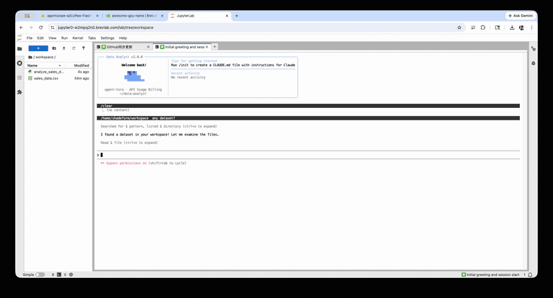

# Data Analyst

Interactive TUI data analysis tool powered by local/remote LLM models. Built on the Claude Code engine with a streamlined toolset focused on autonomous data exploration, analysis, and visualization.

<p align="center">
  
</p>

## Features

- **Interactive TUI**: Rich terminal interface with blue-themed design
- **OpenAI-Compatible API**: Works with any OpenAI-compatible endpoint — OpenRouter, Ollama, vLLM, LM Studio, SiliconFlow, etc.
- **6 Core Tools**: Bash, Read, Write, Edit, Glob, Grep — everything needed for data analysis workflows
- **Compact System Prompt**: ~2k token data-analyst-focused prompt (vs ~30k generic prompt), optimized for smaller local models
- **Python Analysis**: Run pandas, numpy, matplotlib, seaborn, scipy, scikit-learn scripts directly
- **Auto-Visualization**: Models save plots with `plt.savefig()` to the working directory

## Quick Start

### Prerequisites

- [Bun](https://bun.sh) (v1.1+)
- An OpenAI-compatible API endpoint

### Installation

```bash
git clone https://github.com/IIIIQIIII/data-analyst.git
cd data-analyst
bun install
```

### Configuration

Set your API endpoint and model via environment variables:

```bash
# OpenRouter example
export CLAUDE_CODE_USE_OPENAI=1
export OPENAI_BASE_URL=https://openrouter.ai/api/v1
export OPENAI_API_KEY=sk-or-v1-your-key-here
export OPENAI_MODEL=z-ai/glm-5.1

# Ollama example
export CLAUDE_CODE_USE_OPENAI=1
export OPENAI_BASE_URL=http://localhost:11434/v1
export OPENAI_API_KEY=unused
export OPENAI_MODEL=qwen2.5:14b
```

Note: `CLAUDE_CODE_USE_OPENAI=1` is auto-set by the CLI entry point, but you can also set it explicitly.

### Run

```bash
bun run start
```

Or directly:

```bash
bun run --preload ./stubs/globals.ts ./src/entrypoints/cli.tsx
```

## Architecture

This project is a focused fork of the Claude Code TUI framework. Key modifications:

| Component | Change |
|-----------|--------|
| System Prompt | Replaced ~30k generic prompt with ~2k data-analyst prompt |
| Tools | Trimmed to 6 core tools (Bash, Read, Write, Edit, Glob, Grep) |
| API Layer | Uses built-in OpenAI-compatible shim (`openaiShim.ts`) |
| Branding | Custom blue theme, bar chart icon, "Data Analyst" identity |
| Entry Point | Simplified `cli.tsx`, auto-enables OpenAI mode |

### Project Structure

```
src/
├── entrypoints/cli.tsx     # Simplified entry point
├── constants/prompts.ts    # Data-analyst system prompt
├── services/api/
│   └── openaiShim.ts       # OpenAI-compatible API bridge
├── components/LogoV2/      # TUI components (blue theme)
├── utils/theme.ts          # Blue color scheme
└── tools.ts                # 6-tool configuration
```

## Supported Models

Any model accessible via OpenAI-compatible API, including:

- **OpenRouter**: GLM-5.1, DeepSeek, Qwen, Llama, etc.
- **Ollama**: Local models (Qwen2.5, Llama 3, Mistral, etc.)
- **vLLM / LM Studio**: Self-hosted inference servers
- **SiliconFlow**: Chinese model hosting platform
- **Any OpenAI-compatible endpoint**

## Example Usage

```
> Load the CSV file in this directory and show me a summary

> Create a scatter plot of price vs. rating, colored by category

> Run a correlation analysis on all numeric columns

> Find outliers using IQR method and save the cleaned data
```

## License

Based on [Claude Code](https://github.com/anthropics/claude-code) by Anthropic.
